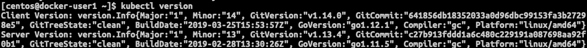
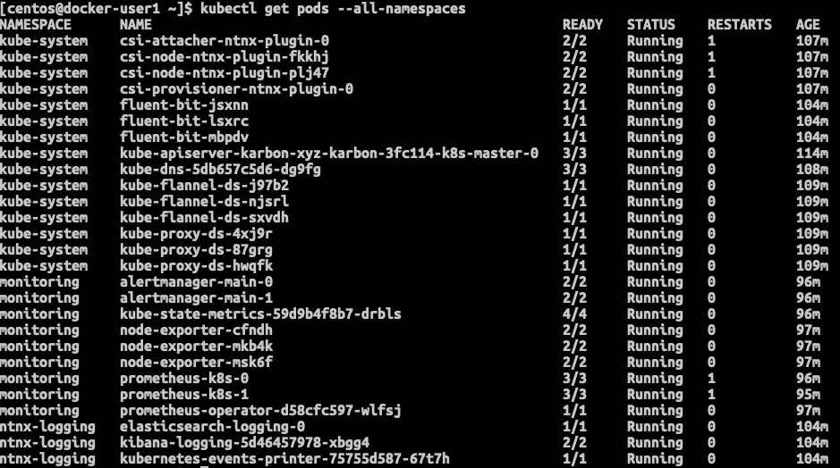

.. _karbon:

------
Karbon
------

*The estimated time to complete this lab is 60 minutes.*

Overview
++++++++

Nutanix Karbon is an on-prem turnkey curated enterprise-grade Kubernetes service offering that simplifies the provisioning, operations and lifecycle management of Kubernetes.

Karbon provides a consumer-grade experience for delivering Kubernetes on-prem providing huge savings on OpEx of dedicated DevOps or SRE teams to keep Kubernetes online, up to date or integrated with 3rd party components and tooling.

**In this lab you will deploy a Kubernetes cluster using Karbon and then deploy multiple containers, referred to as Kubernetes pods, to run a sample application.**

Creating a Karbon Cluster
+++++++++++++++++++++++++

In this exercise you will create a development Kubernetes cluster with Nutanix Karbon.

#. In **Prism Central**, select :fa:`bars` **> Services > Karbon**.

   .. figure:: images/karbon_create_cluster_0.png

   .. note::

     If Karbon has not already been enabled on your cluster, click the **Enable Karbon** button when prompted. Once clicked, the process should take approximately 2 minutes to complete. During this time Prism Central is deploying the Karbon control plane, which runs as a set of containers within the Prism Central VM.

     .. figure:: images/2.png

#. Click the provided link to launch the **Karbon Console**.

   .. note::

     If at any point your Karbon session times out, you can log in again using your Prism Central **admin** credentials.

#. To begin provisioning a Karbon cluster, click **+ Create Cluster**.

#. Select **Development Cluster** and click **Next**.

   .. figure:: images/02.png

#. On the **Name and Environment** tab, fill out the following fields:

   - **Name** - *Initials*-karbon
   - **Cluster** - Select *Your Nutanix cluster*
   - **Kubernetes Version** - 1.13.4
   - **Host OS Image** - centos7.5.1804-ntnx-0.0

   .. figure:: images/3.png

   .. note::

     Your cluster has been pre-staged with a compatible CentOS image for use with Karbon.

     Karbon currently supports CentOS 7.5.1804 and requires that the image be downloaded directly from Karbon **OS Images**.

#. Click **Next**.

   Next you will define the number of container host VMs and compute requirements, starting with **Worker** VMs.

   Worker nodes are responsible for running containers deployed onto the Kubernetes cluster. Each Worker node runs the `kubelet <https://kubernetes.io/docs/admin/kubelet/>`_ and `kube-proxy <https://kubernetes.io/docs/admin/kube-proxy/>`_ services.

#. On the **Node Configuration** tab, fill out the following fields:

   - **VM Network** - Secondary
   - **Number of Workers** - 2 (Default 1)
   - **Memory** - 12 GiB (Default 8)
   - **Size** - 120 GiB (Default)
   - **VCPU** - 4 (Default)

   .. figure:: images/4.png

#. Click **Next**.

   Next you will configure the networking for the pods. Karbon utilizes `Flannel <https://github.com/coreos/flannel#flannel>`_ to provide layer 3 IPv4 network between multiple nodes within the Kubernetes cluster.

   Platforms like Kubernetes assume that each pod (container) has a unique, routable IP inside the cluster. The advantage of this model is that it removes the port mapping complexities that come from sharing a single host IP.

   The **Service CIDR** defines the network range on which services (like etcd) are exposed. The **Pod CIDR** defines the network range used to IP pods. The default configuration allows for a maximum of 256 nodes with up to 256 pods per node.

#. On the **Network** tab, fill out the following fields:

   - **Network Provider** - Flannel (Default)
   - **Service CIDR** - 172.19.0.0/16 (Default)
   - **Pod CIDR** - 172.20.0.0/16 (Default)

   .. figure:: images/6.png

#. Click **Next**.

#. On the **Storage Class** tab, fill out the following fields:

   - **Storage Class Name** - default-storageclass-*Initials*
   - **Prism Element Cluster** - *Your Nutanix cluster*
   - **Nutanix Cluster Username** - admin
   - **Nutanix Cluster Password** - *Your password*
   - **Storage Container Name** - default-container-xyz
   - **Reclaim Policy** - Delete
   - **File System** - ext4 (Default)

   .. figure:: images/7.png

#. Click **Create**.

   Deployment of the cluster should take approximately 10 minutes. During this time, Karbon is pulling images from public image repositories for the **master**, **etcd**, and **worker** nodes, as well as **flannel**, the Nutanix Volumes plugin, and any additional Karbon plugins. Support for authenticated proxy and dark site image repositories will be added post-GA.

   Filtering VMs for *Initials*\ **-karbon** in **Prism Central** will display the master, etcd, and worker VMs provisioned by Karbon.

   .. figure:: images/8.png

   In **Prism Element > Storage > Volume Group**, Karbon has created the **pvc-...** Volume Group, used as persistent storage for logging. Karbon leverages the Nutanix Kubernetes Volume Plug-In to present Nutanix Volumes to Kubernetes pods via iSCSI. This allows containers to take advantage of native Nutanix storage capabilities such as thin provisioning, zero suppression, compression, and more.

   .. figure:: images/9.png

   The Karbon cluster has finished provisioning when the **Status** of the cluster is **Running**.

   .. figure:: images/10.png

#. Click on your cluster name (*Initials*\ **-karbon**) to access the Summary Page for your cluster.

   .. figure:: images/11.png

#. Explore this view and note the ability to create and add additional storage classes and persistent storage volumes to the cluster.

   Additional persistent storage volumes could be leveraged for use cases such as containerized databases.

   You can scale-out your Kubernetes cluster with more worker nodes when needed.

In 15 minutes or less, you have deployed a production-ready Kubernetes cluster with logging (EFK), networking (flannel), and persistent storage services.

Getting Started with Kubectl
++++++++++++++++++++++++++++

`Kubectl <https://kubernetes.io/docs/reference/kubectl/overview/>`_ is the  command line interface for running commands against Kubernetes clusters. `Kubeconfig <https://kubernetes.io/docs/concepts/configuration/organize-cluster-access-kubeconfig/>`_ files contain information about clusters, users, namespaces, and authentication. The ``kubectl`` tool uses **kubeconfig** files to find and communicate with a Kubernetes cluster.

In this exercise you will use ``kubectl`` to perform basic operations against your newly provisioned Karbon cluster.

#. Select your *Initials*\ **-karbon** cluster and click **Actions** > **Kubeconfig**.

   .. figure:: images/12.png

#. Copy the kubeconfig file you have downloaded to your Docker virtual machine using WinSCP or SCP. With the ``centos`` user copy the file remotely to ``~/.kube/config``

   .. note::

     If installed, you can also use a local instance of ``kubectl``. The Docker VM is provided to ensure a consistent experience.

     Instructions for setting up ``kubectl`` in Windows and macOS can be found `here <https://kubernetes.io/docs/tasks/tools/install-kubectl/>`_.

#. From the Docker VM, run the following commands to test ``kubectl``:

   .. code-block:: Shell

     kubectl get nodes

   .. note::

     By default, ``kubectl`` looks like a file named ``config`` in the ``~/.kube`` directory. Other locations can be specified using environment variables or by setting the ``--kubeconfig`` flag.

#. Verify that the output of the last command shows 1 master node and 2 worker nodes as **Ready**.

Cluster and client version
..........................

To see the version of the kubernetes client and server run:

.. code-block:: bash

	kubectl version

Cluster info
............

To see the information of the kubernetes cluster run:.

.. code-block:: bash

	kubectl cluster-info

This will provide information on where the **Kubernetes Master** is running and the **KubeDNS URL**.

.. image:: images/112.png

Running pods
............

If you are interested in all the pods that are running after the installation of the kubernetes cluster run:

.. code-block:: bash

	kubectl get pods --all-namespaces

Deploying an Application
++++++++++++++++++++++++

Now that you have successfully run commands against your Kubernetes cluster using ``kubectl``, you are now ready to deploy an application. In this exercise you will be deploying the popular open-source content management system used for websites and blogs, WordPress.

#. Using your Docker VM create a **wordpress** directory using the following command:

   .. code-block:: bash

   	mkdir ~/wordpress
   	cd ~/wordpress

   Kubernetes depends on YAML files to provision applications and define dependencies. YAML files are a human-readable text-based format for specifying configuration information. This application requires two YAML files to be stored in the **wordpress** directory.

   .. note::

     To learn more about Kubernetes application deployment and YAML files, click `here <https://www.mirantis.com/blog/introduction-to-yaml-creating-a-kubernetes-deployment/>`_.

#. Using your Docker VM, download the following YAML files for Wordpress and the MySQL deployment used by Wordpress:

   .. code-block:: bash

	wget https://kubernetes.io/examples/application/wordpress/mysql-deployment.yaml

	wget https://kubernetes.io/examples/application/wordpress/wordpress-deployment.yaml

#. Open the **wordpress-deployment.yaml** file with ``nano``.

   .. code-block:: bash

     nano wordpress-deployment.yaml

#. Under **spec: > type:**, change the value from **LoadBalancer** to **NodePort** and save the file. This change is required as Karbon does not yet support LoadBalancer.

   .. figure:: images/13.png

   To save the changes press ``CTRL + X``, then ``Y``, and finally [ENTER]

   .. note::

     You can learn more about Kubernetes publishing service types `here <https://kubernetes.io/docs/concepts/services-networking/service/#publishing-services-service-types>`_.

#. Open the **mysql-deployment.yaml** file and note that it requires an environmental variable to define the **MYSQL_ROOT_PASSWORD** as part of deployment. **No changes are required to this file.**

   .. figure:: images/14.png

   Exit with no changes pressing ``CTRL + X``.

#. Define the **secret** to be used as the MySQL password by running the following command:

   .. code-block:: bash

   	kubectl create secret generic mysql-pass --from-literal=password=Nutanix/4u!

   Verify the command returns ``secret/mysql-pass created``.

   You can also verify the secret has been created by running the following command:

   .. code-block:: bash

   	kubectl get secrets

   Verify **mysql-pass** appears in the **NAME** column.

#. You will now provision the MySQL database by running the following command:

   .. code-block:: bash

   	kubectl create -f mysql-deployment.yaml

   .. figure:: images/15.png

#. In addition to the MySQL service, the **mysql-deployment.yaml** also specifies that a persistent volume be created as part of the deployment. You can get additional details about the volume by running:

   .. code-block:: bash

   	kubectl get pvc

   You will note that the **STORAGECLASS** matches the **default-storageclass-**\ *Initials* provisioned by Karbon.

   The volume also appears in **Karbon** under *Initials*\ **-karbon > Volume**.

   .. figure:: images/16.png

#. To view all running pods on the cluster, which should currently only be your Wordpress MySQL database, run the following command:

   .. code-block:: bash

   	kubectl get pods

#. To complete the application, deploy Wordpress by running the following command:

   .. code-block:: bash

   	kubectl create -f wordpress-deployment.yaml

   .. figure:: images/15b.png

#. Verify both pods are displayed as **Running** using ``kubectl get pods``.

   .. figure:: images/16b.png

Accessing Wordpress
+++++++++++++++++++

You have confirmed the Wordpress application and its MySQL database are running. Configuration of Wordpress is done via web interface, but to access the web interface you must first determine the IP addresses of our worker VMs and the port on which the pod is running.

#. The IP addresses of all cluster VMs is returned by the ``kubectl describe nodes`` command. You can run this and search for the **InternalIP** of any of your **worker** VMs, or run the following command to return only the hostnames and IP addresses:

   .. code-block:: bash

   	kubectl describe nodes | egrep 'Hostname|InternalIP'

   .. figure:: images/17.png

#. To determine the port number of the Wordpress application, run the following command and note the TCP port mapped to port 80:

   .. code-block:: bash

   	kubectl get services wordpress

   .. figure:: images/18.png

#. Open \http://*WORKER-VM-IP:WORDPRESS SERVICE PORT*/ in a new browser tab to access to Wordpress installation.

   .. note::

     In the example shown, you would browse to http://10.10.56.183:30163. You environment will have a different IP and port.

   .. figure:: images/19.png

#. Click **Continue** and fill out the following fields:

   - **Site Title** - *Initials*\ 's Karbon Blog
   - **Username** - admin
   - **Password** - nutanix/4u
   - **Your Email** - noreply@nutanix.com

#. Click **Install Wordpress**.

#. After setup completes (a few seconds), click **Log In** and provide the credentials just configured.

   Congratulations! Your Wordpress application and MySQL database setup is complete.

   .. figure:: images/20.png

Exploring Logging & Visualization
+++++++++++++++++++++++++++++++++

Karbon provides a plug-in architecture to continually add additional functionality on top of vanilla Kubernetes. The firsts plug-ins Karbon provides are an integrated logging services stack called **EFK**, short for `Elasticsearch <https://github.com/elastic/elasticsearch>`_, `fluentd <https://www.fluentd.org/>`_ and `Kibana <https://github.com/elastic/kibana>`_; and monitoring and alerting with Prometheus.

Elasticsearch is a real-time, distributed, and scalable search engine which allows for full-text and structured search, as well as analytics. It is commonly used to index and search through large volumes of log data, but can also be used to search many different kinds of documents.

Elasticsearch is commonly deployed alongside Kibana, a powerful data visualization frontend and dashboard for Elasticsearch. Kibana allows you to explore your Elasticsearch log data through a web interface, and build dashboards and queries to quickly answer questions and gain insight into your Kubernetes applications.

Fluentd is a popular data collector that runs on all Kubernetes nodes to tail container log files, filter and transform the log data, and deliver it to the Elasticsearch cluster, where it will be indexed and stored.

#. Return to the **Karbon Console** and select your *Initials*\ **-karbon** cluster.

#. Select **Add-on** from the sidebar to view and manage available Karbon plugins.

   .. figure:: images/21.png

#. Select **Logging** to launch the Kibana user interface.

#. Select **Discover** from the sidebar and define ``*`` as the **Index Pattern**.

   This wildcard will retrieve all available indices within Elastisearch, including **etcd**, **kubernetes**, and **systemd**.

   .. figure:: images/22.png

#. Click **Next Step**.

#. Select **@timestamp** from the **Time Filter field name** drop down menu to allow you to sort logging entries by their respective timestamps.

#. Click **Create index pattern**.

#. Select **Discover** again from the sidebar to view all logs from the Karbon cluster. You can reduce the amount of Kubernetes metadata displayed by adding the **log** entry under **Available Fields**.

   .. figure:: images/23.png

   Advanced Kibana usage, including time series data visualization that can answer questions such as "What is the difference in service error rates between our last 3 application upgrades," is covered in the `Kibana User Guide <https://www.elastic.co/guide/en/kibana/6.2/index.html>`_.

Coming Soon!
++++++++++++

- Upgrades & Patching

  - Non-disruptive Karbon upgrades

  - Immutable OS upgrades of all cluster nodes

- Support for native `Kubernetes RBAC <https://kubernetes.io/docs/reference/access-authn-authz/rbac/>`_

- Darksite Support

  - Local read-only image repository for offline cluster deployments for customers that do not allow internet access

Takeaways
+++++++++

What are the key things you should know about **Nutanix Karbon**?

- Any Nutanix AHV customer is a potential target for Karbon, including:

  - Customers that perform internal development
  - Customers who have or plan to adopt CI/CD
  - Customers with Digital Transformation or Application Modernization initiatives

- The primary benefit of Karbon is reduced CapEX and OpEX of managing and operating Kubernetes environments, reducing learning curve and enabling DevOps/ITOps teams to quickly support their development teams to start deploying containerized workloads.

- Karbon delivers One-Click operations for Kubernetes provisioning and lifecycle management, enabling enterprises to provide a private-cloud Kubernetes solution with the simplicity and performance of public clouds.

- Karbon is included in all AOS software editions at no additional cost.

- Karbon can provide additional functionality to Kubernetes over time through its plugin architecture.

- Karbon is a certified Kubernetes distribution and has passed the `Kuberentes Conformance Certification <https://landscape.cncf.io/landscape=certified-kubernetes-hosted&selected=nutanix-karbon>`_.

- Karbon is listed on the official `Kubernetes Solutions <https://kubernetes.io/docs/setup/pick-right-solution/>`_ and `Cloud Native Computing Foundation Landscape <https://landscape.cncf.io/category=certified-kubernetes-hosted&selected=nutanix-karbon>`_ pages.

Additional Kubernetes Training Resources
++++++++++++++++++++++++++++++++++++++++

- `Introduction to Kubernetes <https://www.edx.org/course/introduction-to-kubernetes>`_ - Free introductory training by The Linux Foundation

- `Play with Kubernetes <https://training.play-with-kubernetes.com/>`_ - Free introductory training and lab environment by Docker

- `Scalable Microservices with Kubernetes <https://www.udacity.com/course/scalable-microservices-with-kubernetes--ud615>`_ - Free intermediate training by Google
